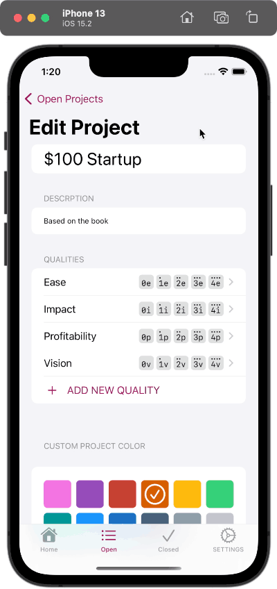
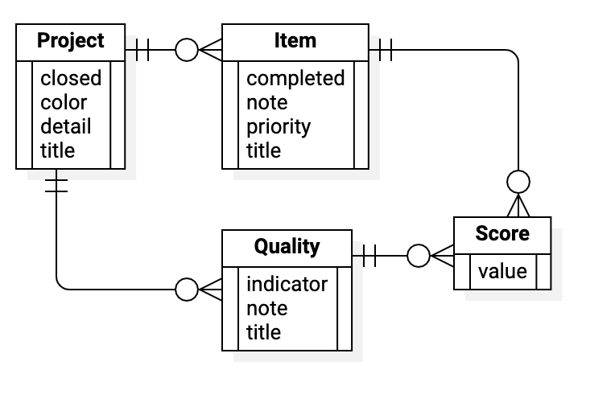

# $0.1k

"Point One K" allows you to make basic trade studies of related items to help prioritize competing options. For example, you may want to start a new side business but you are not able to decide which option is the best, or even which few are better than some of the others. To help you decide you could rate each idea based on its profitability, impact, vision, and ease(-of-effort). This is actually the original motivation for the app as it was inspired by the book ["The $100 Startup" by Chris Guillebeau](https://100startup.com). 

I started sketching this project in SwiftUI in 2020 and it worked then in a limited way using just UserDefaults for several months. I then used this app for the basis of following Paul Hudson's *Ultimate Portfolio App* course starting in mid-2021 as I expanded and generalized the app by integrating, for example, CoreData and internationalization.

As of February 2022 the app is still very much a "work in progress" but it is also already a substantial work that shows some of my experience using Swift and SwiftUI for native iOS app development.

## User Interface

### New Project

Creating a new project and the first item in that project is fast and easy. The user can add scoring qualities before or after adding item. 

### New Quality

Each quality needs a title and then there is other, optional information to add. When viewing a list of items, the score for one scoring quality is shown in small "pills" along with a character or symbol to display instead of the full name. This is the lowercase first letter of the name of the quality by default but it can be overridden to be any single character.

### New Item

An item can be scored immediately if the scoring qualities for the project already exist.

### Edit Quality

On the page showing all of the information for a quality, there is also a collection of all of the items in the project so that they can all be quickly scored on one quality in one screen for fast, easy, consistent scoring in one place. 

## Data Model

Some of the properties were carried over from the Ultimate Portfolio App as I learned all of the intended nuances, while also adding all of the properties I needed for my specific project. 

Summarized:

* `Project` has `[Item]` and `[Quality]`
* Item has `[Score]` (one for each `Quality`)

### `Project`
A Project is the highest level object created. It contains all of the scored Items a well as project-specific information and content that relates to all of the items together. 

#### Attributes
* `closed: Bool` (maybe change to `archive`)
* `color: String`
* `creationDate: Date` (only for learning/tutorial purposes, delete later)
* `detail: String` (notes or description)
* `title: String`

#### Relationships
* `items: [Item]`
* `qualities: [Quality]` (the criteria that each item will be scored on)

### `Item`
The items in a project are scored on the criteria determined when a project is created. Items are compared to each other based on total score. For example, when scoring business ideas, each item is an idea within a same project.

#### Attributes
* `completed: Bool`
* `creationDate: Date` (only for learning purposes, delete later)
* `note: String`
* `priority: Int16` (to group items when viewing a project, if desired)
* `title: String`

#### Relationships
* `project: Project` (the project this item belongs to)
* `scores: [Score]` (the score for each quality described in the Project)

### `Score`
The numeric score used for a quality

#### Attributes
* `value: Int16`

#### Relationships
* `item: Item`
* `quality: Quality`

### `Quality`
One attribute to score by. A set of qualities in a project are what each item will be scored by.

#### Attributes
* `note: String` (option to include scoring guidance notes)
* `title: String` (name)

#### Relationships
* `project: Project` (a project contains one set of qualities)
* `scores: [Score]` (the associated Score object for each item; this really only makes conceptual sense the other direction and this is the requisite reverse relationship)

### Delete Rules
#### Cascade
* Project &rarr; Items
* Project &rarr; Qualities
* Item &rarr; Scores
* Quality &rarr; Scores

#### Nullify
* All others